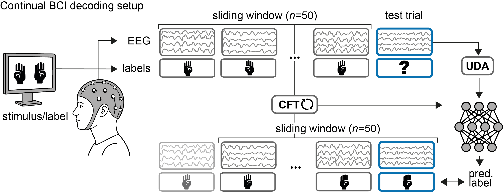

# EDAPT: Towards Calibration-Free BCIs with Continual Online Adaptation



This repository contains research code for the preprint:   
***EDAPT: Towards Calibration-Free BCIs with Continual Online Adaptation***   
by [Haxel*](mailto:lisa.haxel@uni-tuebingen.de), [Kapoor*](mailto:jaivardhan.kapoor@uni-tuebingen.de), [Ziemann](https://ziemannlab.com), and [Macke†](https://mackelab.org) (2025).

## Overview

EDAPT is a task- and model-agnostic framework that enables calibration-free brain-computer interfaces (BCIs) through continual online adaptation. The framework combines population-level pretraining with supervised continual finetuning (CFT) and optional unsupervised domain adaptation (UDA) to continuously adapt decoding models without requiring user recalibration.

## Installation

To run the experiments, first install all requirements. We recommend creating a conda environment. A GPU is recommended for optimal performance.

```bash 
git clone git@github.com:user/EDAPT.git
cd EDAPT
conda create --name edapt python=3.11
conda activate edapt
pip install -e . # install from requirements.txt
# optional: install jupyter notebook
pip install jupyter
```

## Data Setup

The experiments in this paper use nine public EEG datasets. With the exception of one dataset, all data can be automatically downloaded and accessed using the [MOABB framework](https://moabb.neurotechx.com/docs/index.html).

* **MOABB Datasets**: `Lee2019_MI`, `BNCI2014_001`, `BI2015a`, `Huebner2017`, `Huebner2018`, `Lee2019_SSVEP`, `MAMEM2`, and `Kalunga2016` will be handled by the MOABB dependency.
* **Yang2025 Dataset**: This dataset must be downloaded separately from [this source](https://www.nature.com/articles/s41597-025-04826-y) and placed in your data directory.

## Code Structure

The core training and adaptation functionality is implemented in:
- **`train_transfer.py`**: Main training functions for population-level pretraining and online adaptation
- **`tta_wrapper.py`**: Test-time adaptation wrapper implementing the continual learning framework

Experiments can be executed via the submitit files for distributed/cluster computing.

## Framework Components

### Supported Models
The framework supports four established CNN architectures for EEG decoding:
- **EEGNetv4**: Compact architecture with depthwise separable convolutions
- **ATCNet**: Hybrid CNN with multi-head attention and temporal convolution
- **ShallowConvNet**: Temporal + spatial convolution layers (FBCSP-like)
- **DeepConvNet**: Multi-block hierarchical feature learning

### Adaptation Strategies
- **Population-level Pretraining (PRE)**: Learn robust representations from multiple users
- **Continual Finetuning (CFT)**: Supervised online adaptation using recent labeled trials
- **Unsupervised Domain Adaptation (UDA)**: Statistical alignment via covariance correction and adaptive batch normalization

## Running Experiments

The framework has been evaluated on 9 datasets across 3 BCI paradigms:

| Paradigm | Datasets | Description |
|----------|----------|-------------|
| **Motor Imagery (MI)** | Yang2025, Lee2019_MI, BNCI2014_001 | Mental rehearsal of motor actions |
| **P300 Event-Related Potential** | BI2015a, Huebner2017, Huebner2018 | Target detection via P3b neural response |
| **Steady-State Visual Evoked Potential (SSVEP)** | Lee2019_SSVEP, MAMEM2, Kalunga2016 | Frequency classification of flickering stimuli |

### Key Experimental Configurations

```python
# Core EDAPT configurations
configs = {
    "PRE-ZS": "Population pretraining only (zero-shot)",
    "PRE+CFT": "Core EDAPT framework", 
    "PRE+UDA": "Pretraining + unsupervised adaptation",
    "PRE+UDA+CFT": "Full EDAPT framework",
    "CFT-only": "Online learning from scratch"
}
```

### Training Pipeline

1. **Population-level Pretraining**: Train on subset of subjects using cross-validation
2. **Online Adaptation**: Deploy on test subjects with trial-by-trial updates
   - Optional: Apply UDA for distribution alignment
   - Make prediction on incoming trial
   - Update model weights via CFT using sliding window of recent trials

## Generating Figures and Analysis

### CSV Data Generation
The `figures/` directory contains scripts to generate CSV data files needed for analysis:

- `generate_csv_fig2.py`: Trial-by-trial learning dynamics
- `generate_csv_fig4.py`: Scaling analysis (subjects vs. trials)  
- `generate_csv_figs1-3.py`: Comprehensive paradigm comparisons
- `generate_csv_figs4-9.py`: Extended scaling and ablation studies

Run these scripts to generate the necessary CSV files in the `figures/` directory.

### Figure Creation
Use the Jupyter notebooks in the repository to create the figures from the generated CSV data. The notebooks provide interactive analysis and visualization of the experimental results.

## Hardware Requirements

- **CPU**: Multi-core recommended for data processing
- **GPU**: Consumer GPU (RTX 2080Ti or equivalent) for real-time performance
- **Memory**: 8GB+ RAM for larger datasets

## Citation
Please cite our [preprint](https://arxiv.org/abs/2508.10474) if you use this code:
```bibtex
@article{haxel_kapoor2025edapt,
    title={EDAPT: Towards Calibration-Free BCIs with Continual Online Adaptation},
    author={Lisa Haxel and Jaivardhan Kapoor and Ulf Ziemann and Jakob H. Macke},
    year    = {2025},
    journal = {arXiv preprint arXiv: 2508.10474}
}
```

## Contact

Please open a GitHub issue for questions, or send an email to [lisa.haxel@uni-tuebingen.de](mailto:lisa.haxel@uni-tuebingen.de) or [jaivardhan.kapoor@uni-tuebingen.de](mailto:jaivardhan.kapoor@uni-tuebingen.de).
